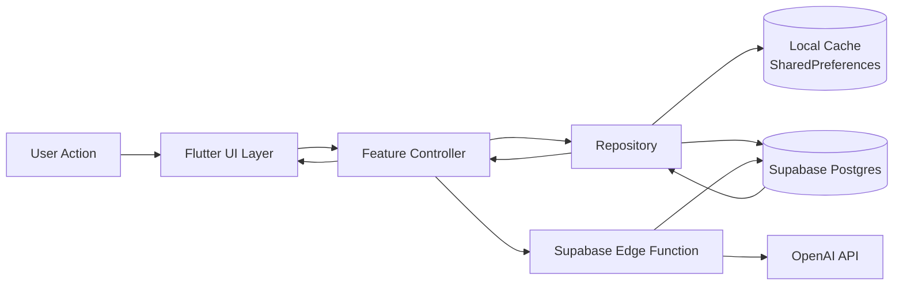

# Architecture Overview

## Monorepo
- `akilli-defter/apps/mobile`: Flutter mobile app (Material 3, TR/EN, offline-first)
- `akilli-defter/backend/supabase`: migrations, RLS, seed data, edge functions
- `akilli-defter/backend/ai/prompts`: versioned prompt specs
- `akilli-defter/docs`: product and demo documentation

## Modules
- **App shell**: auth, locale, theme, workspace state
- **Personal Wallet**: accounts, transactions, budgets, AI summary/categorization
- **Business Ledger**: contacts, deals, collections, cost allocations, FX reporting
- **AI Integration**: Supabase Edge Functions with masked logs + fallback handling

## Data Flow (Mermaid)


## Module Interaction (Mermaid)
```mermaid
graph TD
  App[App State\n(auth, role, locale, workspace)] --> Personal[Personal Wallet Module]
  App --> Business[Business Ledger Module]
  Personal --> WalletRepo[Wallet Repository]
  Business --> BizRepo[Business Repository]
  WalletRepo --> LocalWallet[(Local Wallet Cache)]
  BizRepo --> LocalBiz[(Local Business Cache)]
  WalletRepo --> Supabase[(Supabase DB + RLS)]
  BizRepo --> Supabase
  Personal --> AI1[AI Categorize + Weekly Summary]
  Business --> AI2[Collection Message Draft + FX Insights]
  AI1 --> Edge[Edge Functions]
  AI2 --> Edge
  Edge --> Prompts[Versioned Prompts]
```

## Security + RLS
- `can_access_workspace(workspace_id)` enforces tenancy for workspace-bound tables.
- Accountant role is blocked from personal workspace access.
- AI request logs are PII-masked before persistence.

## Offline-First Strategy
1. Read from local cache immediately.
2. Attempt remote fetch/write when online/Supabase initialized.
3. Persist latest remote state back to local cache.
4. Surface fallback UI text when AI/network is unavailable.
